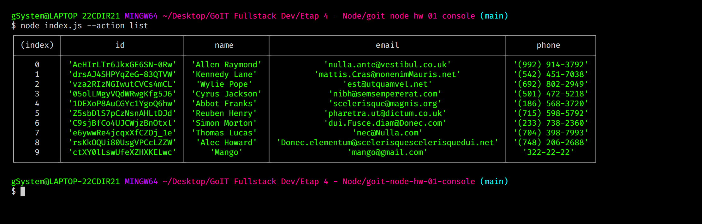
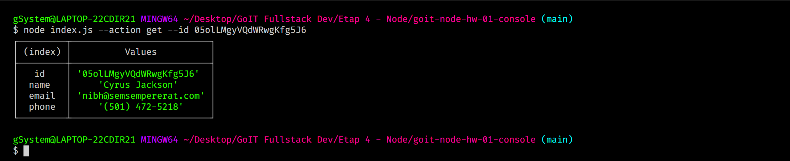
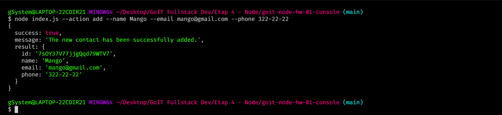
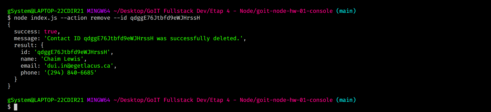
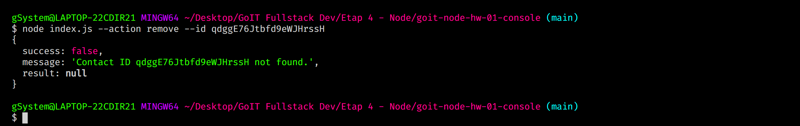

# Manage a list of contacts by adding, displaying, removing, and fetching contact information. (app console)

## List Contacts:

## Find Contacts by Id:

## Add Contacts:

## Remove Contacts:

## Remove Contacts if not exist:


To run the application locally, follow these steps:

1. Clone the repository:
   ```bash
   git clone [repository-url]
   ```

2. Change to the project directory:
   ```bash
   cd [repository-name]
   ```

3. Install and start dependencies:
   ```js
   npm install

   # Get and display the entire list of contacts
   node index.js --action list
   
   # Get contact by id
   node index.js --action get --id 05olLMgyVQdWRwgKfg5J6

   # Add the contact
   node index.js --action add --name Mango --email mango@gmail.com --phone 322-22-22

   # Delete the contact
   node index.js --action remove --id qdggE76Jtbfd9eWJHrssH
   
   ```